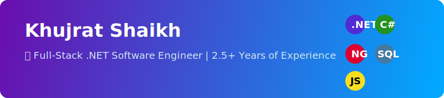

<!-- Banner Section -->

  

<!-- Profile Header -->
<h1 align="center">
  
    Hi 👋, I'm Khujrat Shaikh
  
</h1>
<h3 align="center">
  
</h3>

<!-- Badges -->

  
  
  

---

## 🧑‍💻 About Me
- 💼 **Currently working at:** Net Protector Antivirus  
- 🛠 **Experience:** 2.5+ years in developing dynamic, scalable, and secure web applications  
- 🌱 **Learning:** Advanced Web Technologies & AI  
- 🤝 **Open to Collaborations:** Full-Stack Web Projects  
- 💬 **Ask me about:** `.NET`, `C#`, `Angular`, `Full-Stack Development`  
- 📧 **Reach me at:** [khujratshaikh1284@gmail.com](mailto:khujratshaikh1284@gmail.com)  

---

## 🌐 Connect With Me

  

---

## 🛠 Tech Stack

  

---

## 📊 GitHub Stats

  
  

---

## 🏆 GitHub Trophies

  

---

<!-- Animated Wave Footer -->

